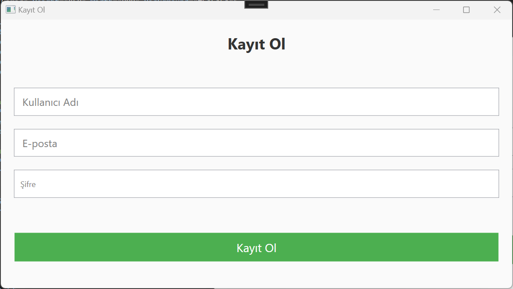
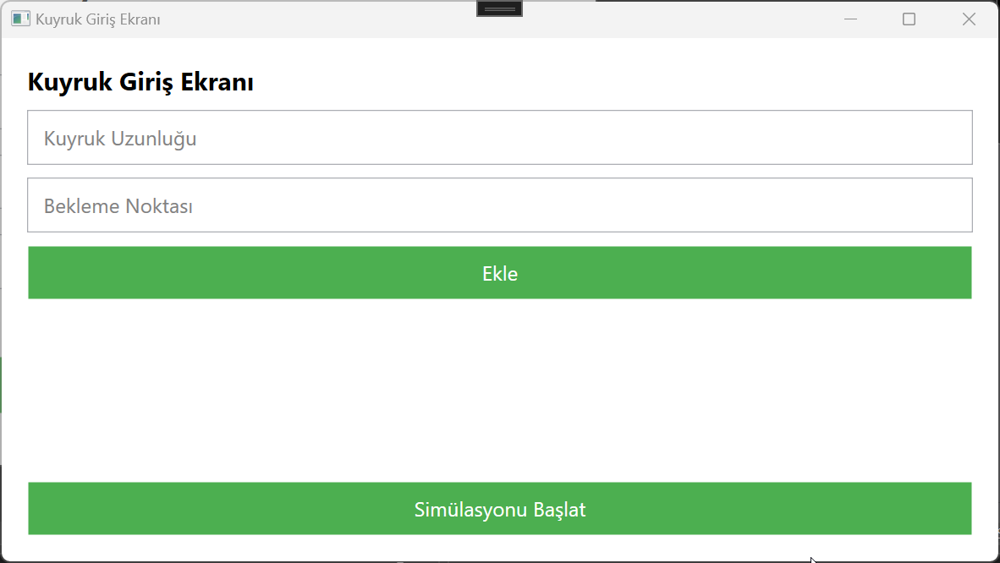
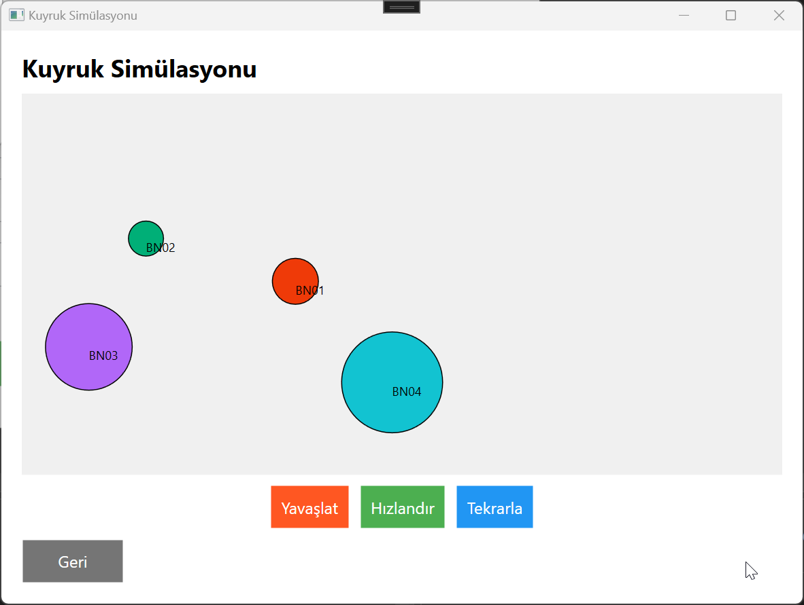
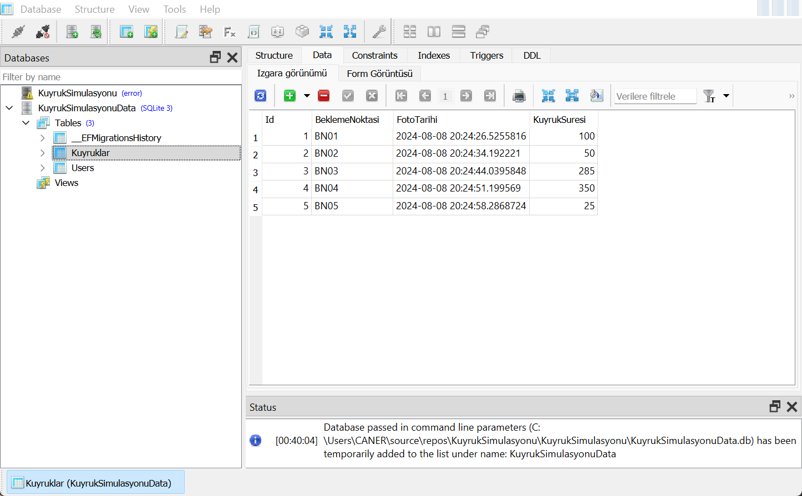
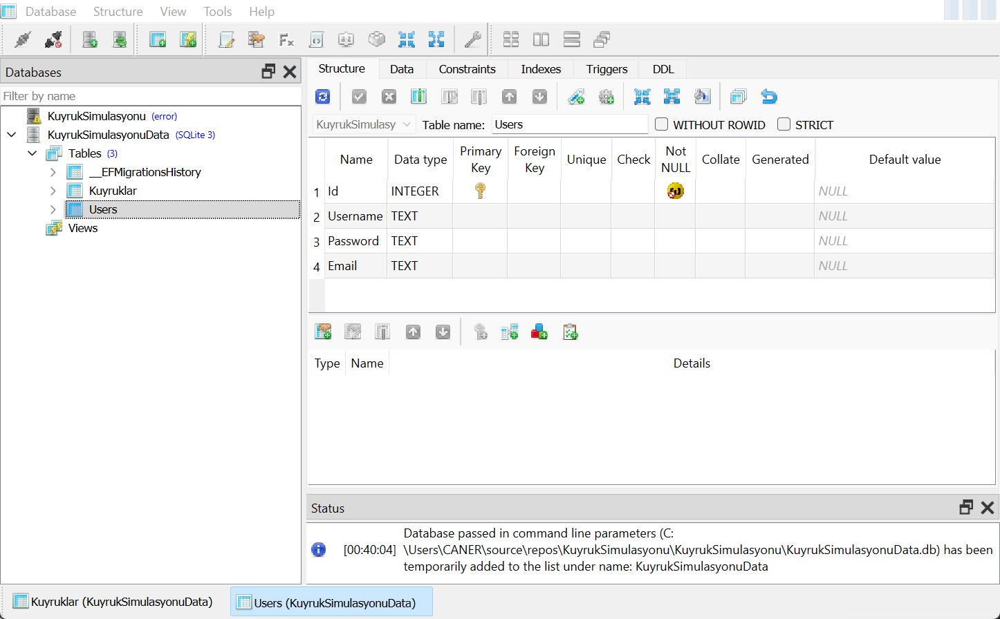
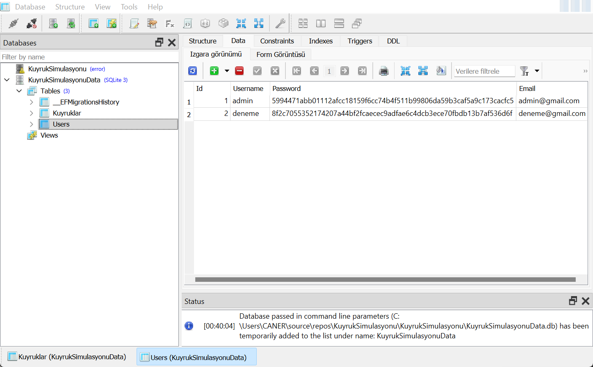
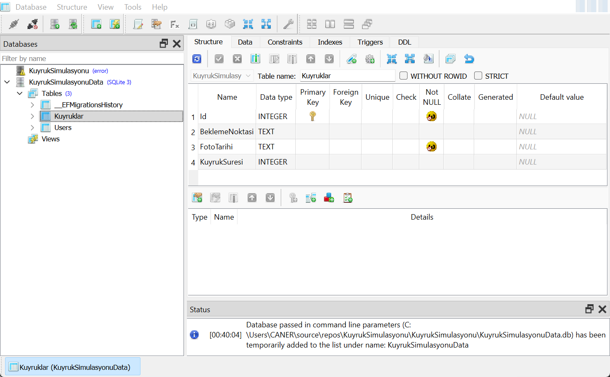
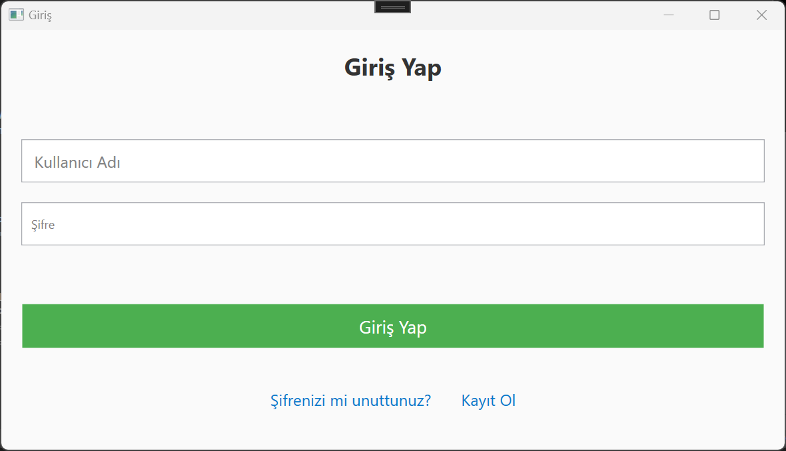
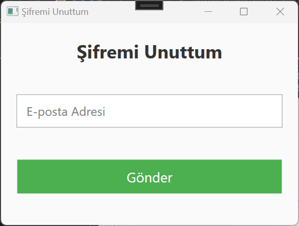

# Kuyruk Simülasyonu

## Proje Açıklaması

Kuyruk Simülasyonu, otobüs duraklarındaki kuyruk uzunluklarını simüle eden bir Windows uygulamasıdır. Uygulama, kuyruk girişlerinin yapılmasını sağlar ve kullanıcıların kuyruk uzunluklarına göre görsel geri bildirim almasını sağlar. Ayrıca, kuyruk simülasyonunu hızlandırma veya yavaşlatma gibi özellikler içerir.

## Özellikler

- **Kuyruk Giriş Ekranı**: Kuyruk verilerinin girilebildiği bir ekran.
- **Simülasyon**: Kuyruk uzunluklarına göre görsel geri bildirim.
- **Hızlandırma/Yavaşlatma**: Simülasyonu hızlandırma veya yavaşlatma özellikleri.
- **Admin Girişi**: Kullanıcı adı ve şifre ile giriş yapabilme.
- **Görsel Geri Bildirim**: Kuyruk uzunluğuna göre dairelerin büyüyüp küçülmesi.

# Kuyruk Simülasyonu

## Ekran Görüntüleri

<p align="center">
    
    
</p>
<p align="center">
    
    
</p>
<p align="center">
    
    
</p>
<p align="center">
    
    
</p>
<p align="center">
    
</p>


## Kurulum

1. **Gereksinimler**:
   - [.NET SDK](https://dotnet.microsoft.com/download) (Proje .NET ile geliştirilmiştir)
   - [Visual Studio](https://visualstudio.microsoft.com/) (WPF ve C# desteği için)

2. **Proje Dosyalarını İndirme**:
   ```bash
   git clone https://github.com/kullaniciadi/kuyruk-simulasyonu.git
