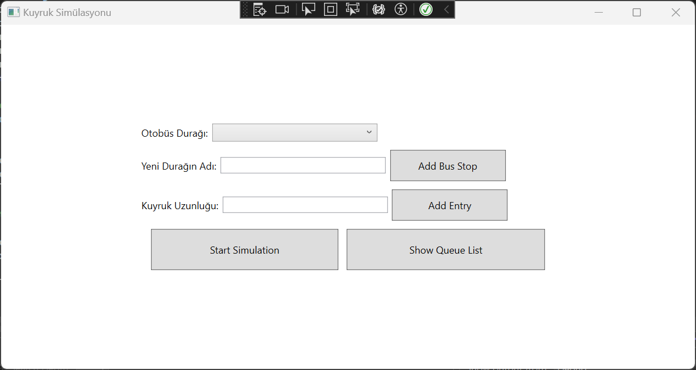
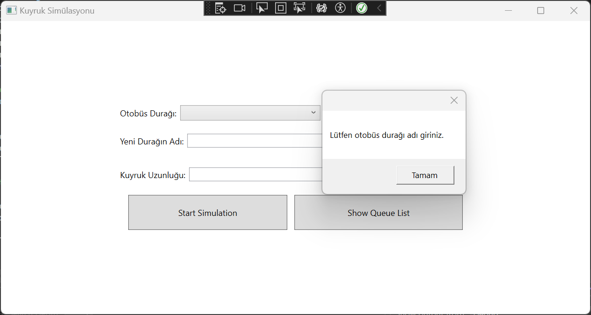
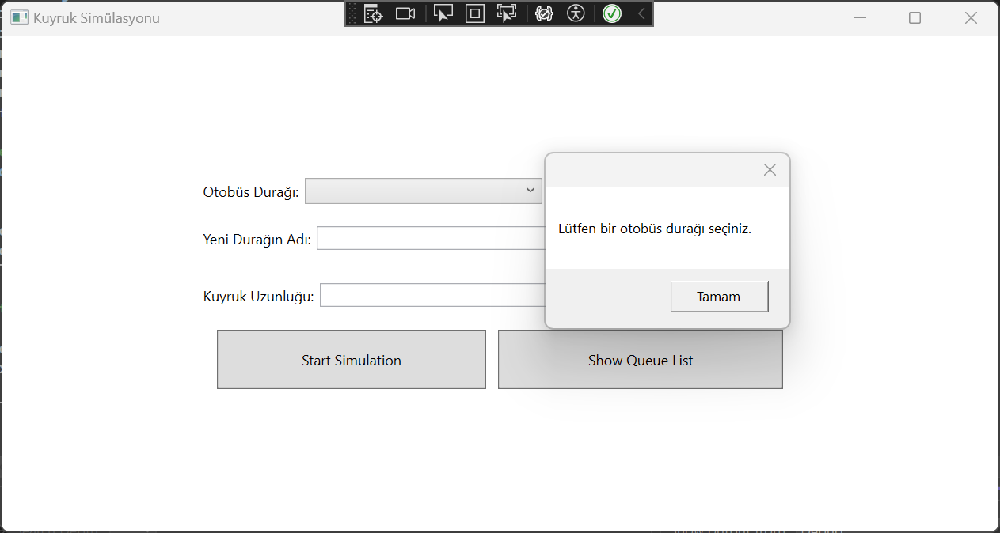
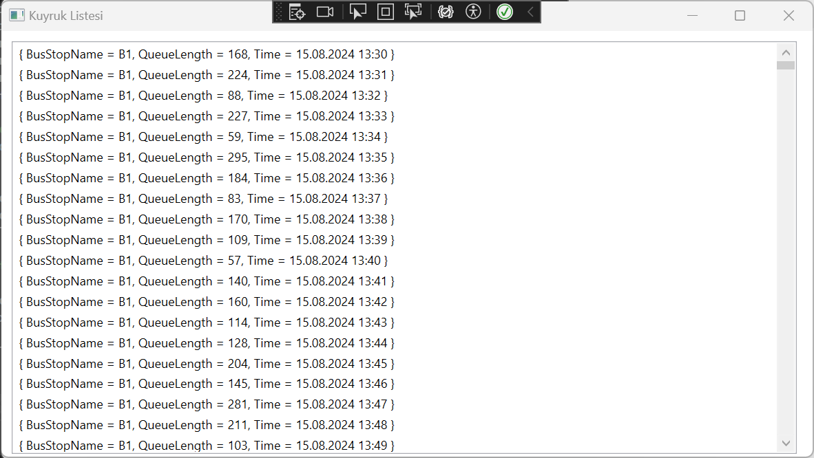
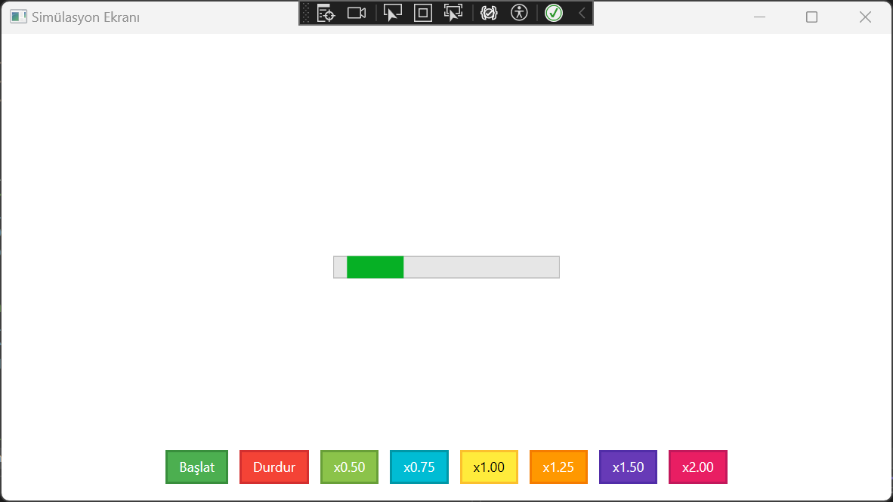
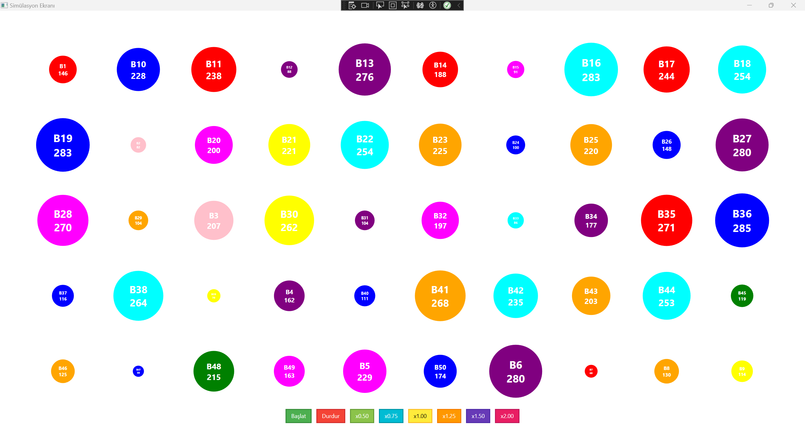

# Kuyruk Simulation

Kuyruk Simulation, otobüs duraklarındaki kuyrukların simülasyonunu gerçekleştiren bir WPF uygulamasıdır. Bu proje, veri tabanındaki kuyruk uzunluklarını görselleştirerek gerçek zamanlı bir simülasyon sağlar. Ayrıca, otobüs duraklarını ekleme ve kuyruk girişleri yapma gibi işlevler de sunar.

  
  

  
  

  
  

## Özellikler

- **Otobüs Durağı Ekleme**: Yeni otobüs duraklarını veritabanına ekleme yeteneği.
- **Kuyruk Girişi Ekleme**: Seçilen otobüs durağına kuyruk uzunluğu ekleme işlemi.
- **Veri Yükleme ve Görselleştirme**: Otobüs duraklarındaki kuyruk uzunluklarını veritabanından yükler ve görsel olarak sunar.
- **Dinamik Daireler**: Kuyruk uzunluklarına göre dairelerin boyutunu dinamik olarak ayarlar.
- **Zamanlayıcı ve Hız Kontrolü**: Simülasyon hızını değiştirme yeteneği sağlar. Kullanıcı, simülasyon hızını 0.25x, 0.50x, 1x, 1.25x ve 2x olarak ayarlayabilir.
- **İnteraktif UI**: Kullanıcı dostu bir arayüz ile simülasyonun başlangıcı ve hızı kolayca kontrol edilebilir.

## Teknolojiler

- **.NET Framework**: WPF uygulaması için kullanılan temel teknoloji.
- **Entity Framework Core**: Veritabanı işlemleri ve veri erişimi için kullanılır.
- **XAML**: Kullanıcı arayüzü tasarımı için kullanılır.
- **C#**: Uygulama mantığını yazmak için kullanılan programlama dili.

